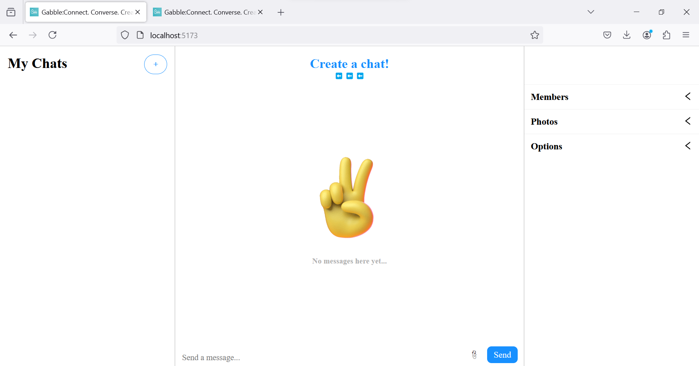

# GABBLE :  Connect. Converse. Create.
# This is a simple chatting website made with Reactjs,Nodejs,Chat Engine.
<h2>Here we had created the backend using NodeJs and communication is done using API-KEY created from Chat Engine.The frontend design is done with Reactjs and the chatting styles is cuztomized
in react-chat-pretty</h2>

Np: If you are clonning this repo,please create your own api key from the site-'Chat engine' and add it into the respective places mention in the code.

<h3>
  First Page
</h3>

<h3>
  Second Page
</h3>

<h3>
  Main Page
</h3>

